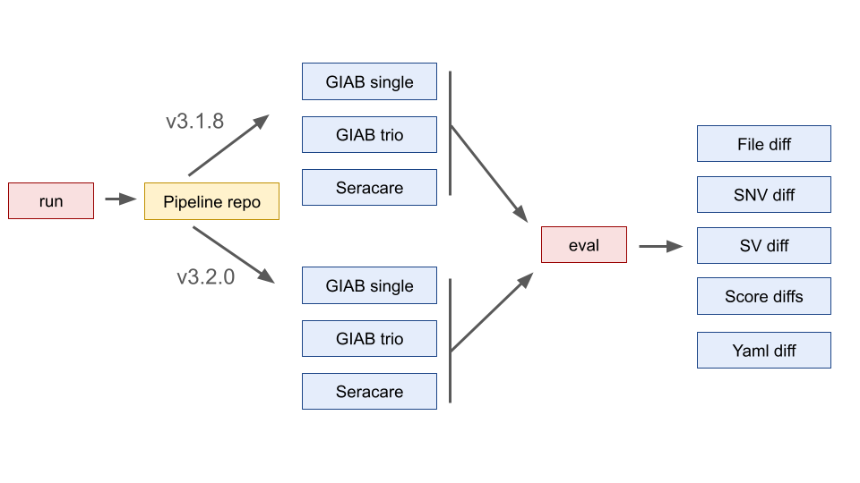

### Outline

The intent with PipeEval is to make more in-depths evaluation of results between pipeline changes easier and faster to carry out.



### Requirements

Written to be compatible with version 3.6 (the version running on our cluster).

Only standard libs are currently used.

### Running the Runner

```{python}
python3 main.py run \
    --checkout jw_update_genmod \
    --base out/genmod \
    --run_type giab_single \
    --start_data bam \
    --repo /path/to/repo \
    --label run1
```

Get more options by running:

```
python3 main.py run --help
```

### Running the evaluator

```{python}
python3 main.py eval \
    --results1 /path/results1 \
    --results2 /path/results2 \
    --outdir /path/eval_out \
    --comparisons default
```

```
python3 main.py eval --help
```